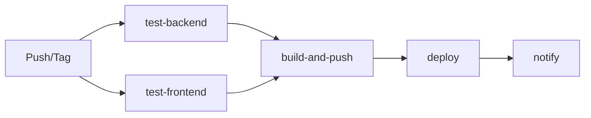

# Deployment Guide — BRTC Training Management System

## Table of Contents

- [Deployment Options](#deployment-options)
- [Docker Deployment (Recommended)](#docker-deployment-recommended)
- [Manual Deployment](#manual-deployment)
- [Production Configuration](#production-configuration)
- [CI/CD Pipeline](#cicd-pipeline)
- [OCR in Production](#ocr-in-production)
- [Database Management](#database-management)
- [Monitoring & Maintenance](#monitoring--maintenance)
- [Troubleshooting](#troubleshooting)

---

## Deployment Options

| Method | Use Case | Complexity |
|--------|----------|------------|
| Docker Compose (dev) | Development / Staging | Low |
| Docker Compose (prod) | Production — single server | Medium |
| CI/CD + Docker | Production — automated | High |
| Manual (no Docker) | When Docker isn't available | High |

---

## Docker Deployment (Recommended)

### Prerequisites

- Docker 24+ and Docker Compose v2+
- Git
- Domain name with DNS pointing to server (for production)
- SSL certificate (for production — auto-managed or manual)

### Quick Start (Development)

```bash
# Clone the repository
git clone <repo-url> project
cd project

# Copy environment file
cp .env.example .env
# Edit .env with your settings

# Start all services
docker compose up -d

# Verify
curl http://localhost/api/health/
```

Services started:
- `db` — PostgreSQL 15 on port 5432
- `redis` — Redis 7 on port 6379
- `backend` — Django + Gunicorn on port 8000
- `celery_worker` — Async task worker
- `frontend` — Vite dev server on port 5173
- `nginx` — Reverse proxy on port 80

### Production Deployment

#### 1. Configure Environment

Create `.env` with production values:

```bash
DJANGO_SECRET_KEY=<generate-a-secure-random-key>
DJANGO_DEBUG=False
DJANGO_ALLOWED_HOSTS=your-domain.com,www.your-domain.com

DB_NAME=brtc_tms
DB_USER=brtc_user
DB_PASSWORD=<strong-db-password>
DB_HOST=db
DB_PORT=5432

CORS_ALLOWED_ORIGINS=https://your-domain.com

CELERY_BROKER_URL=redis://:redis-password@redis:6379/0
CELERY_RESULT_BACKEND=redis://:redis-password@redis:6379/0

# Redis cache (alternative to locmem)
CACHE_BACKEND=redis
REDIS_CACHE_URL=redis://:redis-password@redis:6379/1

# Email (SMTP)
EMAIL_BACKEND=django.core.mail.backends.smtp.EmailBackend
EMAIL_HOST=smtp.gmail.com
EMAIL_PORT=587
EMAIL_USE_TLS=True
EMAIL_HOST_USER=your-email@gmail.com
EMAIL_HOST_PASSWORD=<app-password>
DEFAULT_FROM_EMAIL=BRTC TMS <noreply@your-domain.com>

# SMS
SMS_BACKEND=twilio
TWILIO_ACCOUNT_SID=your-twilio-sid
TWILIO_AUTH_TOKEN=your-twilio-token
TWILIO_PHONE_NUMBER=+8801XXXXXXX

# Site URL (for certificate links, emails)
SITE_URL=https://your-domain.com

# SSL certificate paths
SSL_CERT_PATH=/etc/ssl/certs/your-domain.crt
SSL_KEY_PATH=/etc/ssl/private/your-domain.key

# Tesseract OCR (usually at /usr/bin/tesseract in Docker)
TESSERACT_PATH=/usr/bin/tesseract
TESSERACT_LANG=ben+eng
```

#### 2. Deploy with Docker Compose

```bash
# Pull latest images
docker compose -f docker-compose.prod.yml pull

# Start services
docker compose -f docker-compose.prod.yml up -d

# Run migrations (first time or after model changes)
docker compose -f docker-compose.prod.yml exec backend python manage.py migrate

# Collect static files
docker compose -f docker-compose.prod.yml exec backend python manage.py collectstatic --noinput

# Seed data (optional)
docker compose -f docker-compose.prod.yml exec backend python manage.py seed_data
docker compose -f docker-compose.prod.yml exec backend python manage.py seed_sample_data

# Check logs
docker compose -f docker-compose.prod.yml logs -f
```

#### 3. Verify Deployment

```bash
# Health check
curl https://your-domain.com/api/health/

# Check running containers
docker compose -f docker-compose.prod.yml ps

# View backend logs
docker compose -f docker-compose.prod.yml logs backend
```

### Docker Services (Production)

| Service | Image | Replicas | Port | Healthcheck |
|---------|-------|----------|------|-------------|
| `db` | postgres:16-alpine | 1 | 5432 (localhost) | pg_isready |
| `redis` | redis:7-alpine | 1 | — | redis ping |
| `backend` | ghcr.io/brtc/backend | 2+ | 8000 (expose) | /api/health/ |
| `celery_worker` | ghcr.io/brtc/backend | 1 | — | — |
| `celery_beat` | ghcr.io/brtc/backend | 1 | — | — |
| `nginx` | nginx:1.25-alpine | 1 | 80, 443 | curl localhost |

### Building Docker Images

```bash
# Backend
docker build -t ghcr.io/brtc/backend:latest -f backend/Dockerfile.prod backend/
docker push ghcr.io/brtc/backend:latest

# Frontend
docker build -t ghcr.io/brtc/frontend:latest -f frontend/Dockerfile.prod frontend/
docker push ghcr.io/brtc/frontend:latest
```

The production Dockerfiles use multi-stage builds:
- **Backend**: Builder stage compiles Python wheels → runtime stage with minimal deps
- **Frontend**: Builder stage runs `npm ci && npm run build` → nginx stage serves static files

---

## Manual Deployment (No Docker)

### Backend (Ubuntu/Debian)

```bash
# System dependencies
sudo apt update
sudo apt install -y python3.11 python3.11-venv python3-pip
sudo apt install -y postgresql redis-server
sudo apt install -y nginx
sudo apt install -y tesseract-ocr tesseract-ocr-ben
sudo apt install -y libpq-dev libpango-1.0-0 libcairo2
sudo apt install -y build-essential

# Clone project
git clone <repo-url> /var/www/brtc
cd /var/www/brtc/backend

# Python virtual environment
python3.11 -m venv venv
source venv/bin/activate
pip install -r requirements.txt
pip install gunicorn

# Configure PostgreSQL
sudo -u postgres createuser brtc_user -P
sudo -u postgres createdb brtc_tms -O brtc_user

# Configure environment
cp .env.example .env
# Edit .env with production values

# Migrate & collectstatic
python manage.py migrate
python manage.py collectstatic --noinput

# Configure Gunicorn service
sudo nano /etc/systemd/system/brtc-backend.service
```

```ini
# /etc/systemd/system/brtc-backend.service
[Unit]
Description=BRTC TMS Backend (Gunicorn)
After=network.target postgresql.service redis-server.service

[Service]
User=www-data
Group=www-data
WorkingDirectory=/var/www/brtc/backend
EnvironmentFile=/var/www/brtc/backend/.env
ExecStart=/var/www/brtc/backend/venv/bin/gunicorn \
    --bind 0.0.0.0:8000 \
    --workers 4 \
    --timeout 120 \
    --access-logfile /var/log/brtc/access.log \
    --error-logfile /var/log/brtc/error.log \
    brtc_tms.wsgi:application
Restart=always

[Install]
WantedBy=multi-user.target
```

```bash
sudo systemctl enable brtc-backend
sudo systemctl start brtc-backend
```

### Frontend

```bash
cd /var/www/brtc/frontend

# Install Node.js 18+ (via nvm or nodesource)
curl -fsSL https://deb.nodesource.com/setup_18.x | sudo -E bash -
sudo apt install -y nodejs

# Build
npm ci
npm run build

# The built files will be in dist/ — serve via nginx
```

### Celery

```ini
# /etc/systemd/system/brtc-celery.service
[Unit]
Description=BRTC TMS Celery Worker
After=redis-server.service

[Service]
User=www-data
WorkingDirectory=/var/www/brtc/backend
EnvironmentFile=/var/www/brtc/backend/.env
ExecStart=/var/www/brtc/backend/venv/bin/celery \
    -A brtc_tms worker \
    -l info \
    --concurrency=4 \
    --max-tasks-per-child=1000
Restart=always

[Install]
WantedBy=multi-user.target
```

### Nginx Configuration

```nginx
# /etc/nginx/sites-available/brtc
server {
    listen 80;
    server_name your-domain.com;
    return 301 https://$server_name$request_uri;
}

server {
    listen 443 ssl http2;
    server_name your-domain.com;

    ssl_certificate /etc/ssl/certs/your-domain.crt;
    ssl_certificate_key /etc/ssl/private/your-domain.key;
    ssl_protocols TLSv1.2 TLSv1.3;
    ssl_ciphers HIGH:!aNULL:!MD5;

    # Security headers
    add_header Strict-Transport-Security "max-age=31536000; includeSubDomains" always;
    add_header X-Frame-Options DENY;
    add_header X-Content-Type-Options nosniff;
    add_header X-XSS-Protection "1; mode=block";

    # Gzip
    gzip on;
    gzip_types text/plain text/css application/json application/javascript image/svg+xml;
    gzip_min_length 1000;

    # Static files (from Django collectstatic)
    location /static/ {
        alias /var/www/brtc/backend/staticfiles/;
        expires 365d;
        add_header Cache-Control "public, immutable";
    }

    # Media files (user uploads)
    location /media/ {
        alias /var/www/brtc/backend/media/;
        expires 30d;
        add_header Cache-Control "public";
    }

    # API and admin
    location ~ ^/(api|admin|swagger|redoc)/ {
        proxy_pass http://127.0.0.1:8000;
        proxy_set_header Host $host;
        proxy_set_header X-Real-IP $remote_addr;
        proxy_set_header X-Forwarded-For $proxy_add_x_forwarded_for;
        proxy_set_header X-Forwarded-Proto $scheme;
    }

    # Frontend SPA
    location / {
        root /var/www/brtc/frontend/dist;
        index index.html;
        try_files $uri $uri/ /index.html;

        # Security headers for SPA
        add_header X-Frame-Options DENY;
        add_header X-Content-Type-Options nosniff;
    }

    # Internal health check
    location /health/ {
        access_log off;
        allow 127.0.0.1;
        allow 172.0.0.0/8;
        deny all;
        proxy_pass http://127.0.0.1:8000/api/health/;
    }
}
```

---

## Production Configuration

### Security Checklist

- [ ] `DJANGO_DEBUG=False`
- [ ] Strong `DJANGO_SECRET_KEY` (64+ random chars)
- [ ] PostgreSQL password (not default)
- [ ] Redis password set
- [ ] HTTPS enabled (TLS 1.2+)
- [ ] `CORS_ALLOWED_ORIGINS` set to exact domain(s)
- [ ] `ALLOWED_HOSTS` set to exact domain(s)
- [ ] Non-root user for backend process
- [ ] Database port not exposed to internet
- [ ] File upload size limits configured
- [ ] Rate limiting enabled (default: 100/hr anonymous, 1000/hr authenticated)
- [ ] Regular backups configured

### Environment Variables in Production

All configurable via `.env` file:

| Variable | Required | Default | Description |
|----------|----------|---------|-------------|
| `DJANGO_SECRET_KEY` | Yes | — | Django secret key (generate with `python -c "from django.core.management.utils import get_random_secret_key; print(get_random_secret_key())"`) |
| `DJANGO_DEBUG` | Yes | `False` | Must be `False` in production |
| `DJANGO_ALLOWED_HOSTS` | Yes | — | Comma-separated allowed hosts |
| `DB_NAME` | Yes | `brtc_tms` | PostgreSQL database name |
| `DB_USER` | Yes | `postgres` | PostgreSQL user |
| `DB_PASSWORD` | Yes | — | PostgreSQL password |
| `DB_HOST` | Yes | `localhost` | PostgreSQL host |
| `DB_PORT` | Yes | `5432` | PostgreSQL port |
| `CELERY_BROKER_URL` | Yes | — | Redis URL for Celery broker |
| `CELERY_RESULT_BACKEND` | Yes | — | Redis URL for Celery results |
| `CORS_ALLOWED_ORIGINS` | Yes | — | Comma-separated allowed origins |
| `SITE_URL` | Yes | `http://localhost:8000` | Public site URL |
| `EMAIL_HOST` | For email | — | SMTP server |
| `DEFAULT_FROM_EMAIL` | For email | — | From address for emails |
| `SMS_BACKEND` | For SMS | `console` | `twilio` or `console` |
| `TWILIO_ACCOUNT_SID` | For Twilio | — | Twilio account SID |
| `TESSERACT_PATH` | For OCR | — | Path to tesseract binary |

### Performance Tuning

**Gunicorn:**
```bash
# Formula: (2 × CPU cores) + 1
--workers=4
--timeout=120
```

**Celery:**
```bash
# Adjust based on workload
--concurrency=4
--max-tasks-per-child=1000
```

**PostgreSQL (in `postgres.conf` or docker-compose):**
```
shared_buffers = 256MB           # 25% of RAM
effective_cache_size = 768MB     # 75% of RAM
work_mem = 8MB                   # Per-operation memory
maintenance_work_mem = 64MB      # For VACUUM, CREATE INDEX
```

**Nginx Worker Processes:**
```nginx
worker_processes auto;
worker_connections 1024;
keepalive_timeout 65;
client_max_body_size 20M;        # Match Django's DATA_UPLOAD_MAX_MEMORY_SIZE
```

---

## CI/CD Pipeline

### GitHub Actions Workflow

File: `.github/workflows/deploy.yml`

The pipeline has 5 sequential jobs:



### Pipeline Details

**1. `test-backend`**
- Services: PostgreSQL 16, Redis 7
- Python 3.11, system deps (Tesseract + Bengali data)
- `python manage.py migrate && python manage.py test`

**2. `test-frontend`**
- Node 18, npm cache
- `npm ci && npm run lint && npm run build`

**3. `build-and-push`** (only on push/tag to main)
- Build backend + frontend Docker images
- Push to GitHub Container Registry (`ghcr.io/brtc/*`)

**4. `deploy`**
- SSH to production server
- Pull latest images
- Run migrations and collectstatic
- Restart services with zero downtime

**5. `notify`**
- Slack notification on success/failure
- Email notification on failure

### Triggering a Deployment

```bash
# Push to main triggers the pipeline
git push origin main

# Or create a tag for versioned releases
git tag v1.2.3
git push origin v1.2.3
```

---

## OCR in Production

### Tesseract Installation

**Docker (Ubuntu base):**
```dockerfile
RUN apt-get update && apt-get install -y \
    tesseract-ocr \
    tesseract-ocr-ben \
    && rm -rf /var/lib/apt/lists/*
```

The production `Dockerfile.prod` already includes this in the builder stage.

**Manual (Ubuntu/Debian):**
```bash
sudo apt install -y tesseract-ocr tesseract-ocr-ben
```

**Verify installation:**
```bash
tesseract --version
tesseract --list-langs | grep ben
```

### OCR Configuration

```bash
# In .env
TESSERACT_PATH=/usr/bin/tesseract
TESSERACT_LANG=ben+eng
```

- Docker: Tesseract is at `/usr/bin/tesseract` by default
- Manual install: run `which tesseract` to confirm path

### OCR Performance Considerations

| Concern | Mitigation |
|---------|-----------|
| Image upload size | Limit to 5MB in Nginx + Django |
| Processing time | NID extraction takes 2-5 seconds |
| Concurrent requests | Celery for high-volume OCR (not yet implemented) |
| Storage | Old processed images cleaned via cron |
| Tesseract crashes | pytesseract wraps exceptions gracefully |
| Low confidence | Manual review fallback for < 60% confidence |

### OCR Monitoring

1. Check `/admin/ocr-status/` for Tesseract health
2. Monitor `OcrAuditLog` entries for failure rates
3. Set up alerts if confidence drops below threshold
4. Check the health endpoint: `GET /api/health/` includes OCR status

### OCR Troubleshooting in Production

| Symptom | Cause | Fix |
|---------|-------|-----|
| `TesseractNotFoundError` | Tesseract not installed | Verify `TESSERACT_PATH` |
| Empty extraction results | Bengali data missing | Install `tesseract-ocr-ben` |
| Low confidence (< 60%) | Poor image quality | Guide users to upload clearer images |
| `ben` language not available | Language data not downloaded | `apt install tesseract-ocr-ben` |
| Timeout on OCR requests | Large/slow images | Increase Gunicorn `--timeout` or move OCR to Celery |

---

## Database Management

### Migrations

```bash
# Create new migration after model changes
docker compose exec backend python manage.py makemigrations

# Apply migrations
docker compose exec backend python manage.py migrate

# Show migration status
docker compose exec backend python manage.py showmigrations

# Rollback one migration
docker compose exec backend python manage.py migrate <app_name> <previous_migration>
```

### Backup

The project includes an automated backup script at `scripts/backup.sh`:

```bash
# Manual backup
./scripts/backup.sh

# Or using Docker
docker compose exec db pg_dump -U postgres brtc_tms | gzip > backup_$(date +%Y%m%d).sql.gz
```

### Restore

```bash
# From backup file
gunzip -c backup_20250101.sql.gz | docker compose exec -T db psql -U postgres brtc_tms

# From SQL dump
cat backup.sql | docker compose exec -T db psql -U postgres brtc_tms
```

### Data Migration (to new server)

```bash
# On old server
pg_dump -U postgres -h localhost brtc_tms > dump.sql

# Transfer file (scp, rsync, etc.)
scp dump.sql user@new-server:/tmp/

# On new server
cat /tmp/dump.sql | docker compose exec -T db psql -U postgres brtc_tms
```

---

## Monitoring & Maintenance

### Health Check Endpoints

| Endpoint | Description |
|----------|-------------|
| `GET /api/health/` | Overall system health (DB, cache, Celery, storage, API, backup) |
| `GET /api/admin/ocr-status/` | OCR-specific status (Tesseract version, Bengali data) |

### Logging

The production Docker Compose uses Docker's logging driver. View logs:

```bash
# All services
docker compose -f docker-compose.prod.yml logs -f

# Specific service
docker compose -f docker-compose.prod.yml logs -f backend
docker compose -f docker-compose.prod.yml logs -f nginx

# Last 100 lines
docker compose -f docker-compose.prod.yml logs --tail=100 backend
```

### Regular Maintenance Tasks

| Frequency | Task | Command |
|-----------|------|---------|
| Daily | Database backup | `scripts/backup.sh` (via cron) |
| Weekly | Clear old OCR temp files | `find /tmp/ocr_* -mtime +7 -delete` |
| Monthly | Review error logs | `docker compose logs --since 30d backend \| grep ERROR` |
| Monthly | Django system check | `python manage.py check --deploy` |
| As needed | Clear cache | `docker compose exec redis redis-cli FLUSHALL` |
| As needed | Rebuild search indexes | `python manage.py rebuild_index` (if Haystack/Watson used) |

### Scaling

For high-traffic deployments:

1. **Scale backend horizontally**: Increase `backend` service replicas
   ```bash
   docker compose -f docker-compose.prod.yml up -d --scale backend=4
   ```

2. **Database connection pooling**: Add PgBouncer between backend and PostgreSQL

3. **CDN for static/media files**: Serve `static/` and `media/` from CDN (configure in `settings.py`)

4. **Redis Sentinel/Cluster**: For high-availability Redis

5. **Separate OCR workers**: Offload OCR processing to dedicated Celery workers

---

## Troubleshooting

### Common Issues

| Problem | Likely Cause | Solution |
|---------|-------------|----------|
| `Connection refused` to DB | PostgreSQL not started | `docker compose start db` |
| `ModuleNotFoundError` | Missing Python deps | `pip install -r requirements.txt` |
| Static files 404 | `collectstatic` not run | `python manage.py collectstatic --noinput` |
| CORS errors in browser | Wrong `CORS_ALLOWED_ORIGINS` | Set to frontend URL exactly |
| 502 Bad Gateway from nginx | Backend not running | `docker compose ps backend` |
| 413 Request Entity Too Large | File upload exceeds limit | Increase `client_max_body_size` in nginx |
| Celery tasks not executing | Redis not reachable | Check `CELERY_BROKER_URL` |
| JWT token invalid | Clock skew | Sync server time with NTP |
| Permission denied on media | Wrong ownership | `chown -R www-data:www-data media/` |
| OCR returning gibberish | Bengali tessdata missing | Install `tesseract-ocr-ben` package |

### Health Check Reference

A healthy system returns from `GET /api/health/`:

```json
{
  "database": "ok",
  "cache": "ok",
  "celery": "ok",
  "storage": "ok",
  "api": "ok",
  "backup": "ok",
  "ocr": {
    "tesseract_installed": true,
    "tesseract_version": "5.3.3",
    "bengali_data": true
  }
}
```

Any `status` field returning something other than `ok` indicates a problem requiring investigation.

### Getting Help

- Check Docker logs: `docker compose logs -f <service>`
- Check Django error logs: `docker compose logs backend | grep ERROR`
- Check nginx error logs: `docker compose logs nginx | grep error`
- Run Django system check: `python manage.py check --deploy`
- Verify environment: `docker compose exec backend env | grep DJANGO`
